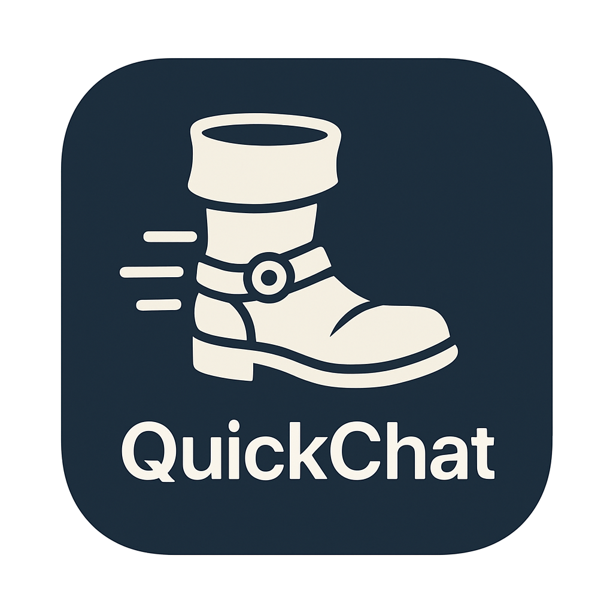
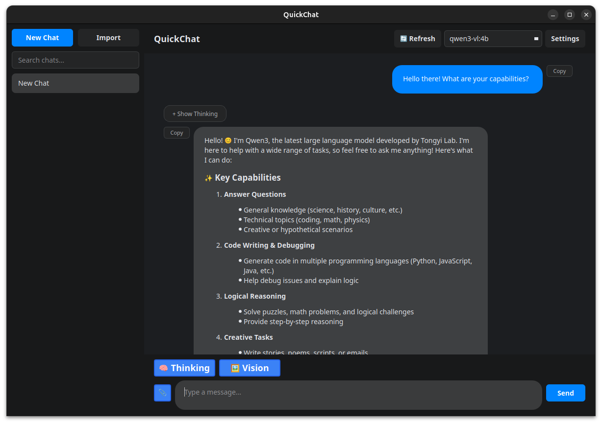

# QuickChat

A sleek, feature-rich chat interface for local LLM inference with Ollama on GNOME Linux or Windows with chat Forking feature.  

Welcome to **QuickChat**! 🎉 This desktop app brings a professional, intuitive experience to your local AI chats. Built with PySide6 for speed and style, it's designed to make interacting with Ollama models feel effortless and fun. Whether you're brainstorming ideas or analyzing images, QuickChat has you covered—all locally on your machine.  




## Table of Contents
- [Features](#-features)
- [Quick Start](#-quick-start)
- [System Requirements](#-system-requirements)
- [Installation](#-installation)
- [Usage Guide](#-usage-guide)
- [Architecture](#-architecture)
- [Advanced Features](#-advanced-features)
- [Troubleshooting](#-troubleshooting)
- [Performance Tips](#-performance-tips)
- [Privacy & Security](#-privacy--security)
- [Uninstallation](#-uninstallation)
- [Contributing](#-contributing)
- [Acknowledgments](#-acknowledgments)
- [Changelog](#-changelog)

## ✨ Features

QuickChat packs powerful tools into a clean interface. Here's what you'll love:

### 🧠 Advanced Thinking
- **Dual Modes**: Supports parameter-based (Ollama API) and directive-based (GGUF with `/think`/`/no_think`).
- **Auto-Detection**: Checks model capabilities on load.
- **Visualization**: Real-time thinking bubbles (collapsible).
- **Control**: Toggle per message, with safeguards.

### 👁️ Vision & Images
- **Formats**: PNG, JPG, WebP, and more.
- **Auto-Enable**: For vision-capable models.
- **Smart Handling**: Sends only the latest image; preserves thumbnails in history.

### 💬 Conversation Tools
- **Smart Naming**: AI-generated titles (no thinking delay).
- **Forking**: Branch from any message via right-click.
- **History**: SQLite-backed persistence.
- **Export/Import**: Markdown (readable) or JSON (full data).
- **Search**: Quick keyword filtering in sidebar.

### 🎨 UI/UX
- **Themes**: Dark/Light with auto-save.
- **Animations**: Smooth notifications and transitions.
- **Streaming**: Real-time response generation.
- **Shortcuts**: Enter to send, Ctrl+Enter or Shift+Enter for newline.
- **Responsive**: Adapts to any window size.

### 🛡️ Safeguards
- **During Generation**: Locks chat switches, imports, model changes; allows typing and stopping.
- **Notifications**: Friendly alerts explain restrictions.

### ⚙️ Configuration
- **Model Selector**: Dropdown with refresh; set default.
- **Settings**: Theme, default model, app info.

## 🚀 Quick Start

Let's get you chatting in minutes!

### Installation
Run the script for a hassle-free setup:
```bash
# Clone or download, then:
cd QuickChat
bash ./install.sh
```
It handles venv, dependencies, and desktop shortcuts.

### Launch
- Terminal: `quickchat`
- Or search "QuickChat" in your menu.

### First Steps
1. Start Ollama (`ollama serve`).
2. Pick a model from the dropdown.
3. Type and hit Enter—watch the magic!
4. Try extras: Toggle 🧠 for thinking or 🖼️ for images.

## 📋 System Requirements

- **OS**: GNOME Linux (Ubuntu 20.04+, etc.) or Windows.
- **Python**: 3.8+.
- **RAM**: 4GB min (8GB+ recommended).
- **Ollama**: Local install with models.

Dependencies (auto-installed): PySide6, ollama, SQLAlchemy, qasync, mistune, pygments, aiohttp, Pillow, matplotlib.

## 📦 Installation

### Automated (Recommended)
`bash ./install.sh` – Sets up everything.

### Manual (Linux)
```bash
mkdir -p ~/.local/share/quickchat/app
cd ~/.local/share/quickchat/app
# Copy files: src/, main.py, config/, icon.png, requirements.txt
python3 -m venv venv
source venv/bin/activate
pip install -r requirements.txt
# Create launcher in ~/.local/bin/quickchat
```

### Development
```bash
git clone <repo>
cd QuickChat
python3 -m venv venv
source venv/bin/activate
pip install -r requirements.txt
python3 main.py
```

### Windows
Double-click `setup.bat` (installs venv/deps), then `run.bat` to launch. 

Manual:
```cmd
python -m venv venv
venv\Scripts\activate.bat
pip install -r requirements.txt
python main.py
```

## 🎮 Usage Guide

### Basic Chatting
Select model, type message, Enter to send. Responses stream live!

### Thinking Mode
Toggle 🧠—see reasoning in bubbles. Auto-adapts to model type.

### Vision Mode
Toggle 🖼️, attach image, ask questions. Thumbnails stay in history.

### Managing Chats
- **New/Switch**: Buttons in sidebar (locked during generation).
- **Fork**: Right-click message > "Fork Chat from Here".
- **Search**: Top sidebar box.
- **Export**: Right-click chat > Markdown/JSON.
- **Import**: Button in sidebar.

### Customization
Settings dialog: Theme toggle, default model. Changes persist.

## 🏗️ Architecture

Compact and modular:
- **core/**: Database (SQLite/SQLAlchemy).
- **services/**: Chat management, Ollama client, settings, Markdown.
- **ui/**: Main window, widgets (header/sidebar/chat/input), dialogs.
- Entry: `main.py`.

## 🔧 Advanced Features

- **Capability Detection**: API first, then keywords (e.g., qwen3).
- **Message Prep**: Adds directives or params based on model.
- **Thinking Extraction**: Strips `<think>` tags during streaming.
- **Vision Opts**: Sends latest image only; caches metadata.
- **State Management**: Protects UI during responses/thinking/titling.

## 🐛 Troubleshooting

- **Won't Start**: Reinstall; check Python/Ollama.
- **Thinking Disabled**: Use supported models; refresh list.
- **Images Fail**: Check format/model; verify file.
- **No Scrollbar**: Use wheel/arrows in dropdown.
- **Chats Gone**: Restore from `~/.local/share/quickchat/data/quickchat.db`.

## 📊 Performance Tips

- Use small/quantized models.
- Close apps; use SSD for Ollama.
- Smaller images speed up vision.
- Archive old chats for faster loading.

## 🔒 Privacy & Security

Everything local—no clouds, tracking, or telemetry. Data in `~/.local/share/quickchat/` and `~/.config/QuickChat/`.

## 🗑️ Uninstallation

`bash ./uninstall.sh` – Option to keep data. Or manual remove.

## 🤝 Contributing

Join in! Help with UI, perf, features, docs, or bugs. Submit PRs with details.

## 🙏 Acknowledgments

Thanks to Ollama, PySide6, Mistune, SQLAlchemy, and the local AI community!

## 📝 Changelog

### v1.0.0
Initial release: Thinking/vision support, full chat tools, themes, safeguards.

---

Made with ❤️ for local AI enthusiasts. Happy chatting—let's build something amazing! 🚀
